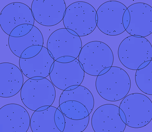
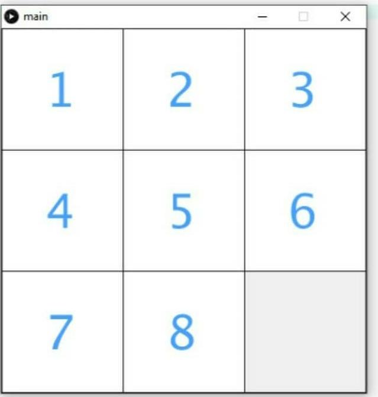

# Machine learning projects 
Some machine learning projects implemented during my BSc in Computer (2016).

## [k-Nearest Neighbors](https://github.com/roscibely/machine-learning-projects/tree/master/k-nearest-neighbors)

Implementation of k-Nearest Neighbors (KNN) for wine 🍷 classification.

   1. The data were obtained through the [website](https://archive.ics.uci.edu/ml/machine-learning-databases/wine/wine.data)
   2. [More specifications](https://archive.ics.uci.edu/ml/datasets/wine)

## [Genetic Algorithm (GA)](https://github.com/roscibely/machine-learning-projects/tree/master/genetic-algorithm)

Smallest-circle problem with GA: The problem is that a certain number of discs are put in order to cover all points. It is analogous to the real problem of location of the telecommunications antennas in the geographical space.

## [Simulated Annealing](https://github.com/roscibely/machine-learning-projects/tree/master/simulated-annealing)

Smallest-circle problem with simulated Annealing

## [A* search algorithm](https://github.com/roscibely/machine-learning-projects/tree/master/A-star-search-algorithm/main)

Implementation of A* search algorithm for the 8 puzzle

## [Regression models](https://github.com/roscibely/machine-learning-projects/tree/master/regression-models)

 - Gradient Boosting for regression. [Read more about](https://scikit-learn.org/stable/modules/generated/sklearn.ensemble.GradientBoostingRegressor.html)  
 - Random forest regressor. [Read more about](https://scikit-learn.org/stable/modules/generated/sklearn.ensemble.RandomForestRegressor.html)
 - Linear Regression [Read more about](https://scikit-learn.org/stable/modules/generated/sklearn.linear_model.LinearRegression.html)
 
